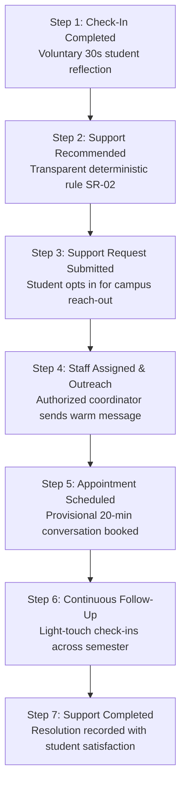

# 🌊 EmoSpot — Small signals. Brighter tomorrows.

<p align="center">
  
</p>

<p align="center">
  <strong>A University Student Wellbeing Early-Support & Cross-Department Coordination Platform</strong>
</p>

<p align="center">
  
  
  
  
  
  
</p>

<p align="center">
  <em>“Every student deserves to be heard, supported, and never left alone.”</em><br>
  — <strong>The FANTASTIC_6 Motto</strong>
</p>

---

## 📌 Executive Summary

**EmoSpot** is a university student wellbeing **early-support platform** created to solve the invisible student wellbeing crisis in mid-sized higher education institutions.

In contemporary universities, student support is fragmented across dozens of disconnected offices. Students often struggle silently with coursework pressure, sleep disruption, and campus transition, not knowing where to seek help until minor friction compounds into an acute academic or emotional crisis.

EmoSpot bridges this divide by connecting:
$$\textbf{Voluntary Check-In} \longrightarrow \textbf{Signal Analysis} \longrightarrow \textbf{Early Support Signal} \longrightarrow \textbf{Authorized Staff Dashboard} \longrightarrow \textbf{Human-Led Outreach} \longrightarrow \textbf{Continuous Support Journey}$$

### 🎯 Primary Challenge Track: 02 — Early Warning System

Our platform addresses the three central bottlenecks of the mid-sized university challenge scenario:
1. 📈 **+40% Surge in Referrals:** Mental health and advising services are overwhelmed by reactive crisis handling.
2. 🏛️ **12 Fragmented Support Departments:** Support is siloed across Academic Advising, Residence Life, Counselling, Financial Aid, Health Services, Accessibility, etc.
3. ⏳ **3-Week Initial Wait Times:** Students wait up to 21 days for an initial appointment—a window in which manageable stress can spiral into course withdrawal.

> **Our Core Thesis:**  
> *“A student may experience one problem. The university sees it across 12 disconnected services.”*

---

## 🛡️ Core Philosophy: Support, Not Surveillance

> [!IMPORTANT]
> **EmoSpot is NOT a medical diagnosis system.**  
> EmoSpot strictly rejects automated psychological categorization, depression prediction, and algorithmic risk scores. We believe technology should listen for subtle friction to empower **human kindness early**, while preserving complete student agency and data ownership.

### Compassionate Microcopy Standard

| ❌ Instead of Stigmatizing Language | ✅ EmoSpot Dignified Phrasing |
| :--- | :--- |
| *"High-risk student"* | **"Needs follow-up"** |
| *"Risk detected / Alert"* | **"Support recommended"** / **"Wellbeing signal changed"** |
| *"Predict depression"* | **"Notice changes in voluntary wellbeing signals"** |
| *"AI diagnostic decision"* | **"Suggested next step"** |
| *"Monitor student"* | **"Support journey"** |
| *"Depressed / Mentally ill"* | **"Support may be helpful right now"** |

---

## 🌟 Architectural Novelty: The Continuous Support Journey

Traditional early-warning dashboards stop at the notification, dropping students into bureaucratic voids. EmoSpot's hallmark novelty is its **Continuous Support Journey**—an unbroken 7-stage visual lifecycle that updates reactively across both student and staff portals:



---

## 👥 Two Tailored Role-Based Experiences

EmoSpot provides strictly role-gated experiences built with **ServiceNow enterprise thinking + Apple-like simplicity**:

### 1. 🎓 Student Experience (Warm, MindShift-Inspired, Non-Clinical)
- **Daily Reflection Check-In:** 5-step guided reflection capturing mood, academic workload, sleep changes, support preferences, and explicit consent.
- **Quick Support Micro-Tools:**
  - 🌬️ **4-7-8 Rhythmic Breathing Pacer:** Animated vagus-nerve pacing circle with cycle counters.
  - ✋ **5-4-3-2-1 Sensory Grounding Tool:** Interactive stepped room scan to break anxiety loops.
  - 🧠 **Shift Your Thinking:** Cognitive defusion reframing prompts for coursework overwhelm.
  - ⏱️ **15-Minute Study Sprint Reset:** Low-friction timer to bypass avoidance paralysis.
  - 🤝 **Direct Reach Out:** 1-click confidential opt-in for university coordinator contact.
- **Learn Library:** Curated, non-clinical guides on sleep hygiene in residence halls, managing assignment pile-ups, and navigating campus resources with interactive modal readers.
- **Wellbeing Micro-Goals:** Non-competitive personal habit tracker with gentle daily streak counters.
- **Moderated Peer Community:** Safe peer-encouragement channels operating under anonymous handles (`MahathiM`) to protect student identity while normalizing vulnerability.
- **Share & Support:** Private progress sharing with trusted allies, anonymous peer invites, and educational guides on opening up.
- **My Support Journey:** Real-time visibility into who is assigned to assist, scheduled sessions, and next actions.
- **Privacy & Consent Center:** Transparent data boundaries, active consent toggles, and FERPA-compliant JSON data export.

### 2. 🏛️ Department Staff Portal (Authorized, FERPA Tier 2, Collaborative)
- **Student Wellbeing Overview Dashboard:**
  - 5 Operational KPIs: Total Students (1,420), Needing Attention, Follow-Ups Pending, Support Requests, Avg Response Time (1.8 hrs vs 21-day baseline).
  - Recharts Visualizations: Semester wellbeing distribution, common concerns breakdown, cross-department coordination rates.
- **Students Needing Follow-Up:** Neutral, filterable table sorting students by priority, latest check-in, key concerns, and days since last contact.
- **Student Case Drilldown:** 6 integrated tabs (Case Overview, Check-In History, Reported Concerns, Staff Notes, Appointments, and Support Journey).
- **Explainable Transparent Signal Engine:** Transparent audit breakdown displaying the deterministic campus logic (*e.g. Rule SR-02: Academic & Sleep Indicator Co-occurrence*).
- **Proactive Outreach Suite:** Multi-channel messaging modal (Portal notification, University email, direct SMS) with AI-assisted compassionate phrasing templates and provisional appointment booking.
- **12-Department Coordination Hub:** Active tracking across Counselling, Advising, ResLife, Financial Aid, Health Center, Accessibility, Career Center, and Student Affairs.

---

## 🗺️ Complete 31-Page Website Architecture

```
PUBLIC WEBSITE
├── 1. Landing / Home            (/)
├── 2. About Our Purpose         (/about)
├── 3. How It Works (5-Step)     (/how-it-works)
├── 4. Features & Capabilities   (/features)
├── 5. Challenge Impact          (/impact)
├── 6. Meet FANTASTIC_6          (/team)
└── 7. Campus Contact            (/contact)

AUTHENTICATION
├── 8. Role Selection            (/role-select)
├── 9. Student Login / Signup    (/student-login)
└── 10. Staff SSO Portal Login   (/staff-login)

STUDENT PORTAL
├── 11. Student Dashboard        (/student-dashboard)
├── 12. Student Check-In (5-Step)(/student-checkin)
├── 13. Check-In Result Summary  (/student-summary)
├── 14. My Wellbeing Trends      (/student-wellbeing)
├── 15. Quick Support Tools      (/student-quick-tools)
├── 16. Learn / Resources        (/student-learn)
├── 17. Wellbeing Goals          (/student-goals)
├── 18. Peer Community           (/student-community)
├── 19. Share & Support          (/student-share)
├── 20. Support Appointments     (/student-appointments)
├── 21. My Support Journey       (/student-journey)
├── 22. Student Profile          (/student-profile)
└── 23. Privacy & Consent        (/student-privacy)

DEPARTMENT STAFF PORTAL
├── 24. Staff Overview Dashboard (/staff-dashboard)
├── 25. Students Needing Attention(/staff-attention)
├── 26. Student Case Drilldown   (/staff-student-detail)
├── 27. Outreach & Messaging     (/staff-outreach)
├── 28. Department Appointments  (/staff-appointments)
├── 29. Campus Wellbeing Trends  (/staff-analytics)
├── 30. Coordination Reports     (/staff-reports)
└── 31. Staff Profile & Settings (/staff-settings)
```

---

## 💻 Tech Stack & Engineering Standards

- **Frontend Core:** React 18, TypeScript 5, Vite 8
- **Styling & Design System:** Tailwind CSS v3 with tailored HSL tokens (Deep Navy `#1E1B4B`, Soft Blue `#38BDF8`, Violet `#8B5CF6`, Mint `#10B981`, Warm Lavender `#F5F3FF`, Light Canvas `#F8FAFC`)
- **Data Visualizations:** Recharts (Area charts, Donut charts, Bar charts)
- **Icons:** Lucide React
- **State Management:** Reactive Context Store synchronized with `localStorage` for persistent demo continuity
- **Typography:** Plus Jakarta Sans & Inter
- **Accessibility:** WCAG AAA high-contrast ratios, semantic HTML5, screen-reader labels, non-color-dependent status indicators

---

## 🚀 Quick Start Guide

### Prerequisites
- Node.js `v18+` or `v20+`
- npm `v9+` or `v10+`

### Installation & Local Setup

```bash
# 1. Clone the repository
git clone https://github.com/mahathiunique/ServiceNow_Fantastic_6.git
cd ServiceNow_Fantastic_6

# 2. Install dependencies
npm install

# 3. Start local development server
npm run dev
```

Visit **`http://localhost:5173/`** in your browser.

### Production Build

```bash
# Type check and build production bundle
npm run build
```


<p align="center">
  Developed with ❤️ by <strong>FANTASTIC_6</strong> for university student wellbeing.<br>
  <em>EmoSpot is an early support coordination platform. It is not a medical diagnosis system and does not replace certified healthcare professionals.</em>
</p>
